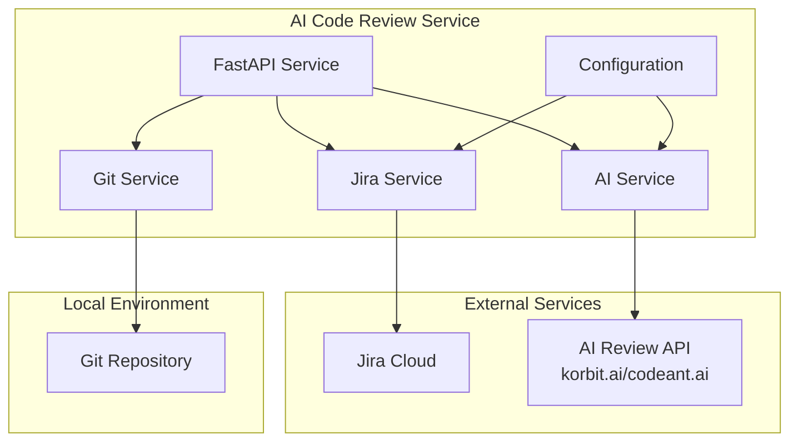
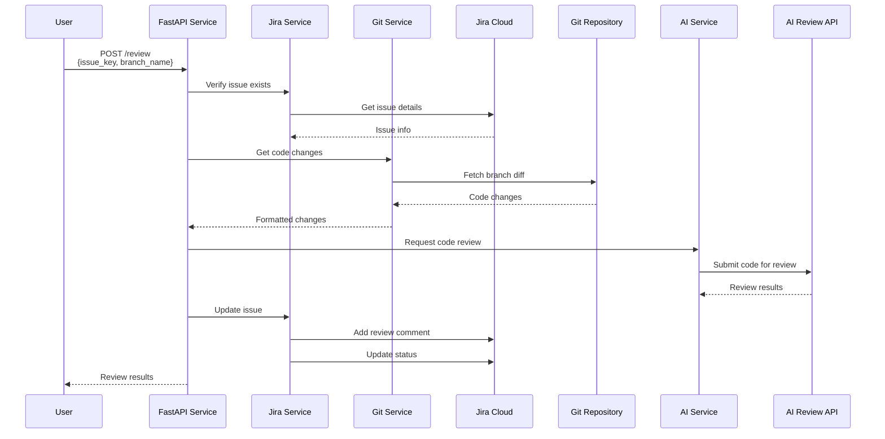
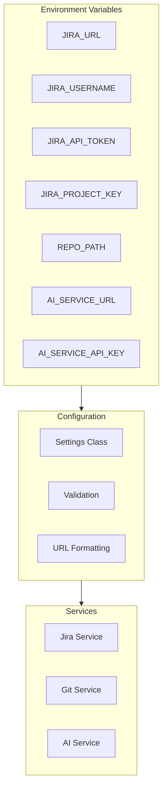

# AI Code Review Architecture

This document describes the architecture and flow of the AI Code Review system integrated with Jira Cloud.

## System Components



## Review Process Flow



## Service Architecture

### FastAPI Service
The main application service built with FastAPI provides:
- RESTful API endpoints
- Request validation using Pydantic models
- Automatic OpenAPI documentation
- Health monitoring
- Service coordination

### Jira Service
Handles all interactions with Jira Cloud:
- Issue verification and retrieval
- Comment management
- Status transitions
- Error handling and retries

### Git Service
Manages local Git operations:
- Branch diff retrieval
- Code change formatting
- Author tracking
- Change metadata collection

### AI Service
Coordinates with the AI review provider:
- Code review requests
- Response processing
- Error handling
- Result formatting

## Data Models

### Review Request
```python
class ReviewRequest(BaseModel):
    issue_key: str      # e.g., "AIREV-123"
    branch_name: str    # e.g., "feature/new-feature"
```

### Review Response
```python
class ReviewResponse(BaseModel):
    status: str         # "success" or "failed"
    issue_key: str      # The reviewed issue
    review_results: dict # Complete review details
```

### Code Changes
```python
CodeChange = Dict[str, Any]
{
    "file_path": str,   # Path to changed file
    "changes": str,     # Actual code changes
    "author": str,      # Change author
    "jira_context": {   # Additional context
        "issue_key": str,
        "issue_summary": str,
        "issue_type": str
    }
}
```

## Configuration Management



## Error Handling

The system implements multiple layers of error handling:

1. **Request Validation**
   - Input validation using Pydantic
   - Project key verification
   - Branch existence checks

2. **Service Errors**
   - Jira connection retries
   - Git operation fallbacks
   - AI service timeouts

3. **Response Processing**
   - Result validation
   - Error formatting
   - Status tracking

## Security Considerations

1. **Authentication**
   - Jira Cloud API tokens
   - AI service API keys
   - No sensitive data in logs

2. **Data Protection**
   - Code changes processed locally
   - Minimal data sent to AI service
   - No storage of sensitive data

3. **Access Control**
   - Project-based access
   - Role-based permissions
   - Audit trail in Jira

## Deployment Considerations

1. **Dependencies**
   - Python 3.11+
   - Git installation
   - Network access to Jira Cloud
   - AI service connectivity

2. **Performance**
   - Async operations where possible
   - Connection pooling
   - Response caching
   - Timeout handling

3. **Monitoring**
   - Health endpoints
   - Service status
   - Error tracking
   - Performance metrics